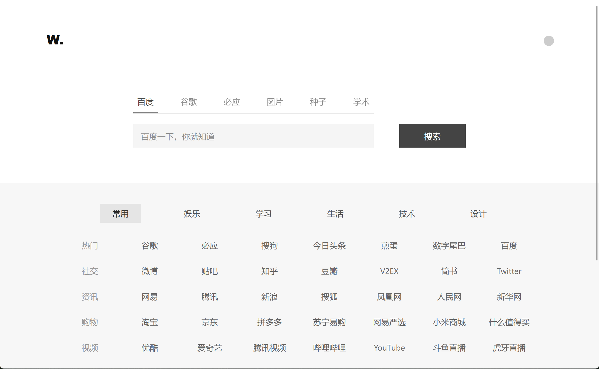

# HTML-guide

> English | [中文](README-CN.md)


This is a navigation bar created using HTML + CSS + JavaScript. I created it to have a better navigation for [EtherDream/jsproxy](https://github.com/EtherDream/jsproxy) because its default navigation is too simple (:

I added a switch in the top right corner to quickly enable proxy mode.




## Installation Steps

1. First, deploy the cf-worker to CloudFlare Worker according to [jsProxy CloudFlare Worker](https://github.com/EtherDream/jsproxy/tree/master/cf-worker#部署).

2. Set a custom domain for your successfully deployed CloudFlare Worker (Go to the Workers & Pages interface, add your domain under Triggers > Custom Domains).

3. Fork this project and modify the content of js/index.js proxy_url:
    ```js
    // Modify this
    var proxy_url = "https://your-deployed-domain/-----";

    // For example, if my deployed domain is: proxy.abc.com
    // Then you should fill it like this (keep the "/-----" at the end):
    var proxy_url = "https://proxy.abc.com/-----";
    ```

4. Create a CloudFlare Pages, select the forked repository, set the Production branch to "main", and Framework preset to "None". Follow the steps until the deployment is complete.

5. Set a custom domain for CloudFlare Pages (After deployment, find "Custom domains" and enter your custom access domain).

6. Congratulations! The deployment is complete.

## Custom Navigation Data

You can configure your own navigation links by modifying the content of comm_list in js/index.js and index.html of the forked project. For example:

Related code in index.html:
```html
<div class="tab">
    <span class="class1">Title 1</span>
	......
</div>
```

Related code in js/index.js:
```javascript
var comm_list = [
  {
    slug: "class1",
    list: [
      {
        tag: "Left Tag",
        link: [
          { name: "Website Name", url: "Website Link" },
          { name: "Google", url: "https://www.google.com/" },
          ......
        ],
      },
    ],
  },
  ......
];

```
Note that the html class="class1" should correspond to javascript slug: "class1", and the website link should include "https://".

## Acknowledgments

Thanks to [EtherDream/jsproxy](https://github.com/EtherDream/jsproxy)

Thanks to [Jquery](https://jquery.com/)

Thanks to [JavaScript Cookie Tools](https://github.com/js-cookie/js-cookie)
